[*Dr. Daniel Gorski*](mailto:Daniel.Gorski@uni-duesseldorf.de)  
[*Dr. Alexander Lang*](mailto:alexander.lang@hhu.de)  
[*Dr. Julia Hesse*](mailto:julia.hesse@uni-duesseldorf.de)  

# Syllabus
### Overview
The aim of this course is to introduce single-cell RNA sequencing (scRNAseq) data analysis to individuals with little or no experience with scRNAseq or R programming. Our intent is to provide foundational knowledge that can be expanded to other computational methods or simply help individuals better critically evaluate scRNAseq studies. We will provide a short overview of scRNAseq technologies, experimental design and typical workflows. Using Seurat, a popular single-cell genomics toolkit, we will guide students through the basic analysis steps, starting from the expression count matrix to cluster annotation.
<br>  

### Schedule

**Self-guided pre-lab setup**  
Please complete the following points before the start of the course, see the `Pre-lab setup` section for instructions     

-   Download course materials from sciebo 
-   Install R
-   Install RStudio
-   Install Rtools
-   Install libraries
-   Install Inkscape


**Day 1**  

9:00-9:30 - Introductions   

9:30-10:30 - Lecture 1 - Introduction to scRNAseq and experimental workflows (*Dr. Julia Hesse*)  

-   Brief history and different types of technologies
-   Basics of droplet based scRNAseq (10x Genomics)
-   Typical workflow in theory (tissue dissociation to clustering)  

10:30-11:30 - Lecture 2 - scRNAseq data analysis and Seurat (*Dr. Daniel Gorski*)  

-   Quality control
-   Normalization, feature scaling, feature selection
-   Dimensional reduction 
-   Clustering
-   Seurat toolkit and object structure  

11:30-12:30 - Break  

12:30-14:30 - Lab 1 - Introduction to R (*Dr. Alexander Lang*)  

-   RStudio layout, intro to “environment”
-   Libraries and Repositories
-   The command-line (Console)
-   Writing R scripts in an editor
-   Objects and functions
-   Vectors, Matrices and Dataframes
-   Exploring data
-   Descriptive statistics
-   Importing, saving and managing data  

14:30-14:35 - Evaluations

**Day 2**  

9:00-11:00 - Lab 2 - Analysis of Farbehi et al. 2019 (*Dr. Daniel Gorski*)  

-   Loading in data
-   Writing meta data
-   Quality control filtering
-   Normalization, scaling and feature selection with SCTransform
-   Clustering
-   Cluster markers and heatmaps
-   Differential gene expression
-   Gene signatures
-   Compositional analysis
-   Annotation
-   Exporting figures  

11:00-13:00 - Lab 3 - Utilizing scRNAseq data outside of R (*Dr. Julia Hesse*)  

-   Working with average expression tables and population marker tables in Excel
-   GOrilla
-   AmiGO
-   STRING
-   MORPHEUS
-   Inkscape

13:00-14:00 - Break

14:00-15:00 - Lecture 3 - Custom analyses (*Dr. Alexander Lang*)  

-   Reference mapping
-   Cerebro: interactive visualization

15:00-17:00 - Lab 4 - Custom analyses (*Dr. Alexander Lang*)

-   Reference mapping
-   Cerebro: interactive visualization  

17:00-17:05 - Evaluations

# Pre-lab setup

```{r klippy, echo=FALSE, include=TRUE}
klippy::klippy(color = "grey", position = c("top", "right"))
```

### Download course materials

1\.  Visit the following sciebo link to download and view the course materials. This folder contains the labs, lectures and data we will use throughout the course.  

|       <https://uni-duesseldorf.sciebo.de/s/SRA5gulHUP8KKMW>  
|       Password: *sent to participants via email*
<br/>
2\.  Click the download button on the top right of the window to save a copy of this folder on your local machine. From now on we will refer to this as our "course folder".

<center>
{width="65%"}
</center>

### Install R

1\.  Download R from a comprehensive R archive network (CRAN) mirror, the mirror at the University of Münster will work fine: <https://cran.uni-muenster.de/>. Click on the link to download R for your operating system. We will proceed with the installation steps for windows machines. If you want to learn more about R, the main website is <https://www.r-project.org/>.

<br/>
<center>
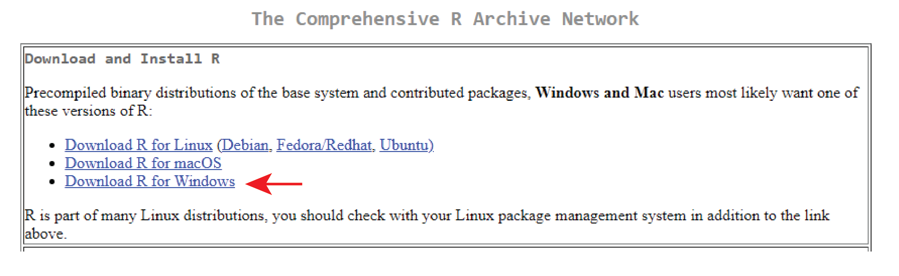{width="65%"}
</center>
<br/>

2\.  Click "install R for the first time", then Download R 4.1.2 for Windows. 

<br/>
<center>
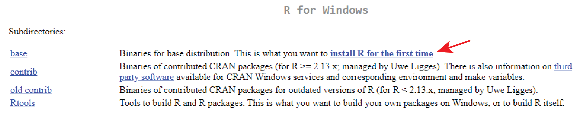{width="65%"}
<br/><br/><br/> 
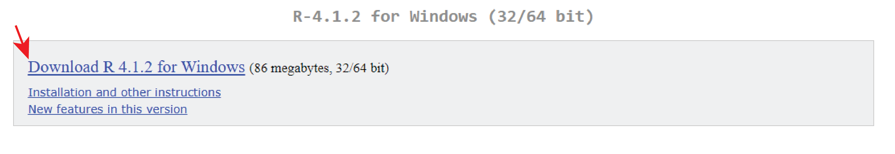{width="65%"} 
<br/><br/>
</center>

3\.  Run "R-4.1.2-win.exe" to install R, and follow the installation steps, select the default options on each prompt.

### Install RStudio

1\.  Visit <https://www.rstudio.com/products/rstudio/> and scroll down to download RStudio Desktop, the free open-source edition.

<br/><br/>
<center>
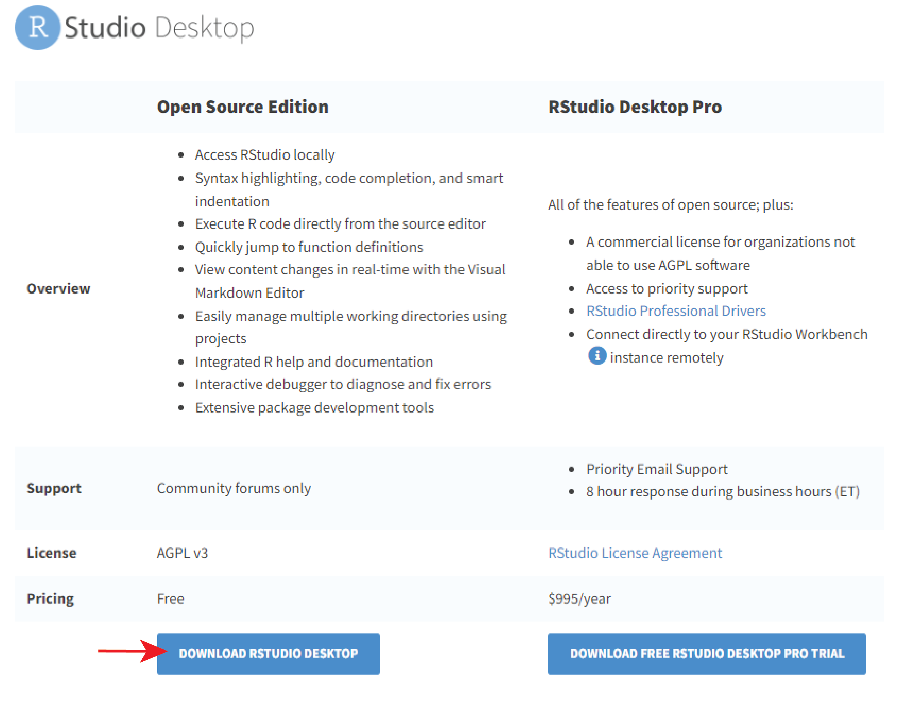{width="65%"}
</center>
<br/><br/>
<center>
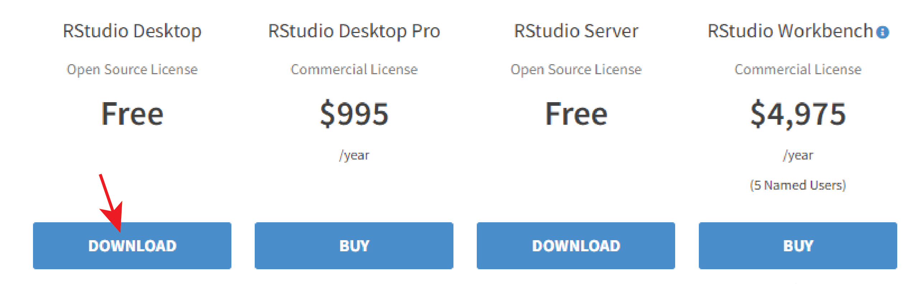{width="65%"}
</center>
<br/><br/> 
<br/><br/>
<center>
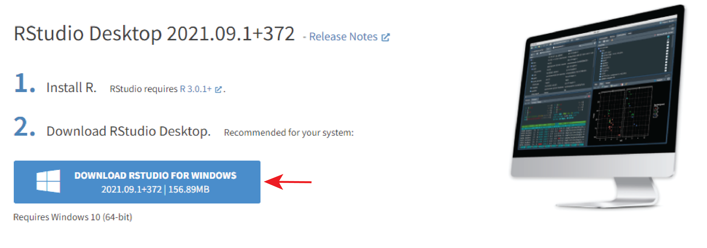{width="65%"}
</center>
<br/><br/>

2\.  Run the Rstudio executable and follow the steps with default selections to install RStudio.

3\.  Start RStudio, you should see something like the image below with multiple panes. These panes can be referred to as the "Console", "Environment" and "Files". Any R code you type into the Console pane will be executed. Your variables, functions and objects will appear in the Environment pane. The Files pane is a convenient file browser.

<br/><br/>
<center>
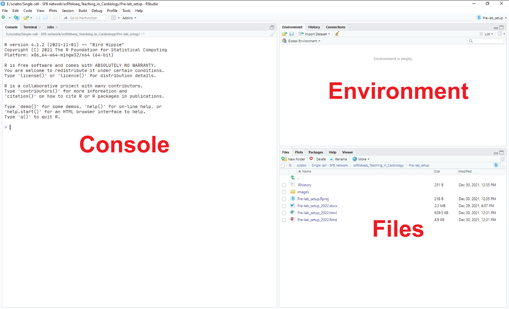{width="65%"}
</center>
<br/><br/>

4\.  If you would like to change the appearance of the RStudio application (recommended), open *Tools > Global Options... > Appearance* and in the *Editor theme* window you will find other themes. e.g. "Idle Fingers" is a dark theme that has nice coloring for functions, variables and operators. This makes reading and writing code a bit easier.

<br/>
<center>
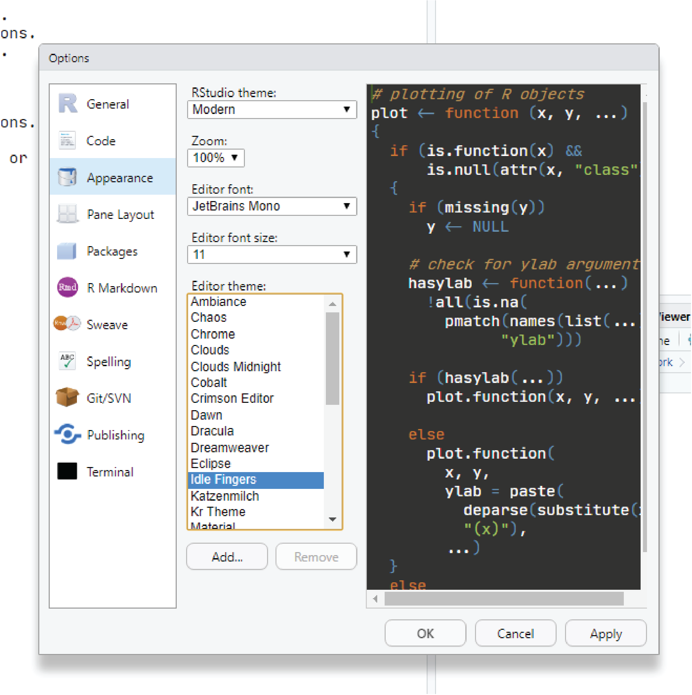{width="65%"}
</center>

### Install Rtools

1\.  Rtools is necessary to compile packages from source code. This may not be required for the current course, but it's nice to have this installed in case you need to use libraries that do not come as precompiled binary packages.

2\.  Visit <https://cran.r-project.org/bin/windows/Rtools/rtools40.html> and follow the directions carefully. Download the appropriate .exe file (likely the 64-bit, but depends on your windows installation).

<br/>
<center>
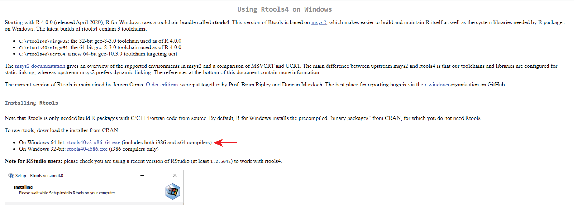{width="65%"}
</center>
<br/>

3\.  Run "rtools40v2-x86_64.exe" with default selections to install Rtools.

4\.  Open Rstudio, paste the following text into the Console and hit enter.

```{r, eval=FALSE}
write('PATH="${RTOOLS40_HOME}\\usr\\bin;${PATH}"', file = "~/.Renviron", append = TRUE)
```

5\.  Close and restart RStudio, paste the following text into the Console and hit enter.

```{r, eval=FALSE}
Sys.which("make")
```

6\.  The path to your Rtools installation should be returned and look something like this:

```{r, echo=FALSE}
Sys.which("make")
```

### Install libraries

1\.  There are multiple ways to install packages (libraries) for R, typically, bioinformatics packages can be found and installed from CRAN, github or Bioconductor. For packages hosted on CRAN, we can download directly in the console by using the function `install.packages()`. For this course we will need to install the following packages:


-   ggplot2
-   dplyr
-   patchwork
-   readr
-   readxl
-   Seurat
-   limma

2\.  Open RStudio and enter the following into the console:

```{r, eval=FALSE}
install.packages('ggplot2')
```

<br/>
<center>
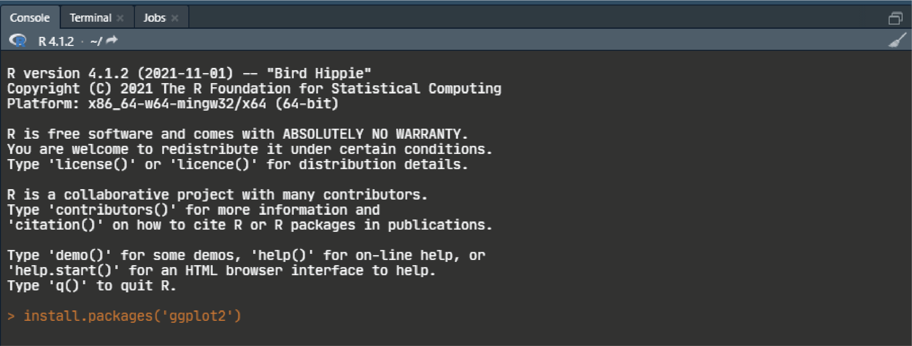{width="65%"}
</center>
<br/>

3\.  Once the installation is finished the output should look something like this: 

<br/>
<center>
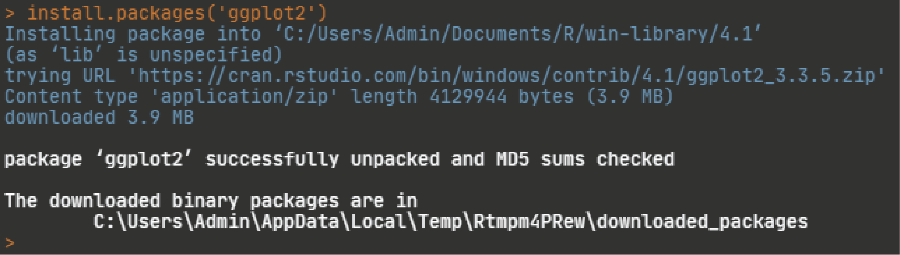{width="65%"}
</center>
<br/>

4\.  Repeat this for the remaining CRAN hosted libraries.

```{r, eval=FALSE}
install.packages('dplyr')
install.packages('patchwork')
install.packages('readr')
install.packages('readxl')
install.packages('Seurat')
```

5\.  Now we need to install the `limma` package, this is hosted on Bioconductor, so we first have to install the Bioconductor installer library, `BiocManager`. Then using `BiocManager` we install the `limma` package. Enter the following into your Console.

```{r, eval=FALSE}
install.packages('BiocManager')
BiocManager::install('limma')
```

6\.  Once we have the libraries installed, we need to load them into our R session using the `library()` function. Load all the libraries, if you do not receive any errors you are all set!

```{r}
library(ggplot2)
library(dplyr)
library(patchwork)
library(readr)
library(readxl)
library(Seurat)
library(limma)
```

### Install Inkscape

1\.  For the "Utilizing scRNAseq data outside of R" lab, we will also need to download and install Inkscape 1.0. Navigate to this site, and follow the instructions for download and installation:  
<https://inkscape.org/de/release/inkscape-1.0/>
